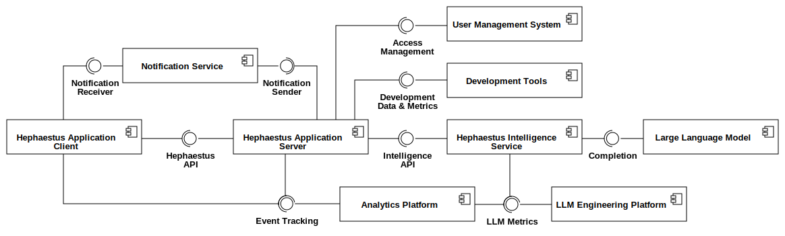

.. _hephaestus:

=====================================================================================================
Hephaestus: Leveraging Generative AI to Enhance Software Development Processes and Developer Training
=====================================================================================================

Unlock the full potential and growth of your development team with Hephaestus. This innovative solution accelerates onboarding, boosts productivity, and enhances team collaboration through intelligent reflection, actionable insights, and continuous education, ensuring your projects thrive in agile environments.

.. figure:: ./images/agile_hephaestus.png
  :height: 250px
  :alt: Hephaestus the Agile God

  Hephaestus /hɪˈfɛstəs/ is the Greek god of blacksmiths, craftsmen, and artisans, symbolizing the fusion of creativity and technical skill.

Introduction
------------

The Hephaestus project aims to enhance software engineering education and the software development lifecycle (SDLC) by integrating an intelligent assistant designed to foster structured reflective practices. Complemented by data-driven insights and feedback mechanisms, this system supports continuous self-improvement and collaborative learning. Hephaestus leverages generative AI, specifically large language models (LLMs), to provide AI-driven insights and adaptive guidance across all phases of the SDLC — planning, analysis, design, implementation, testing & integration, and maintenance.

The primary objective of Hephaestus is to improve the SDLC and developer training, focusing on continuous self-improvement and collaborative learning. By encouraging regular reflection and providing actionable information, Hephaestus guides both personal and team improvements, enhancing overall team efficiency and project success. The system is designed to help novice developers integrate seamlessly into teams, becoming productive and collaborative members quickly. Additionally, Hephaestus aims to develop essential software development skills, emphasizing agile methodologies, reflective practices, and effective teamwork.

Key Features
============

1. **Intelligent Reflection**: The intelligent assistant encourages developers to engage in regular reflection, fostering continuous self-improvement and learning.
2. **Data-Driven Insights**: The system provides actionable insights derived from development activities, guiding both personal and team improvements.
3. **Feedback Mechanisms**: Integrated feedback mechanisms provide continuous and contextual feedback, enabling rapid identification and resolution of issues.
4. **Enhanced Onboarding**: Accelerate the integration of novice developers into teams, ensuring they become productive and collaborative members quickly.
5. **Support for Agile Methodologies**: Ensures that teams can adopt and refine agile practices effectively, promoting effective teamwork and professional growth.

Architecture
------------

  Hephaestus Top Level Design (UML Component Diagram)

.. toctree::
  :caption: Contributor Guide
  :includehidden:
  :maxdepth: 3

  dev/getting_started/getting_started

.. toctree::
  :caption: System
  :includehidden:
  :maxdepth: 3

  system/gamification/index
