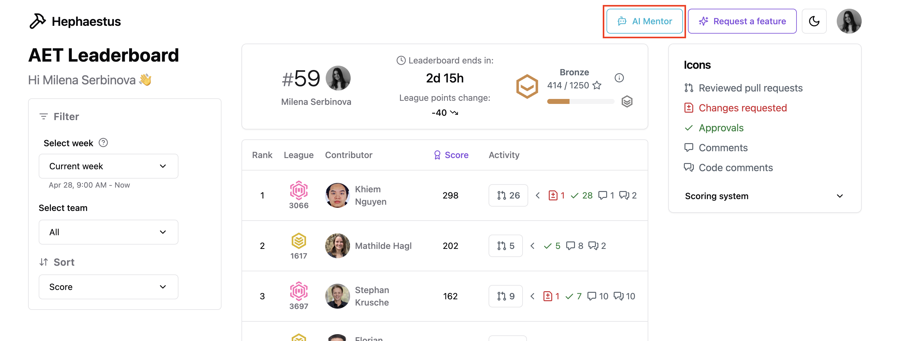
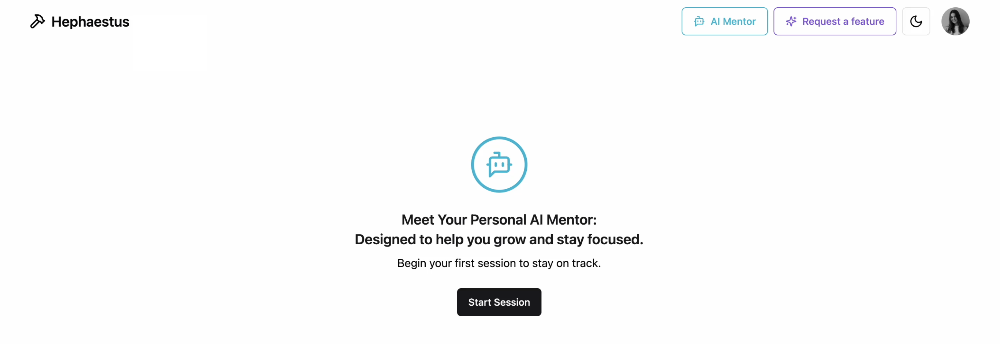
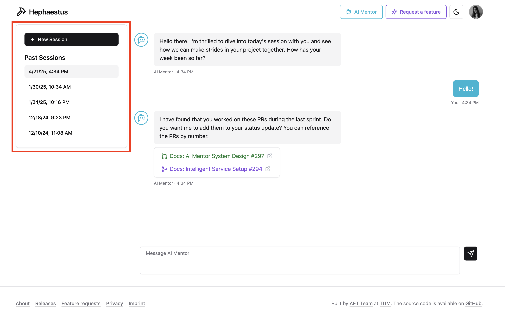
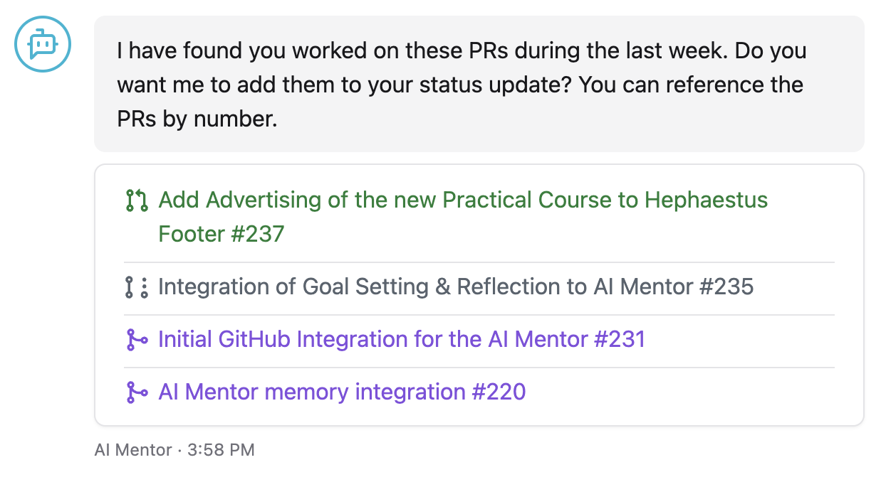
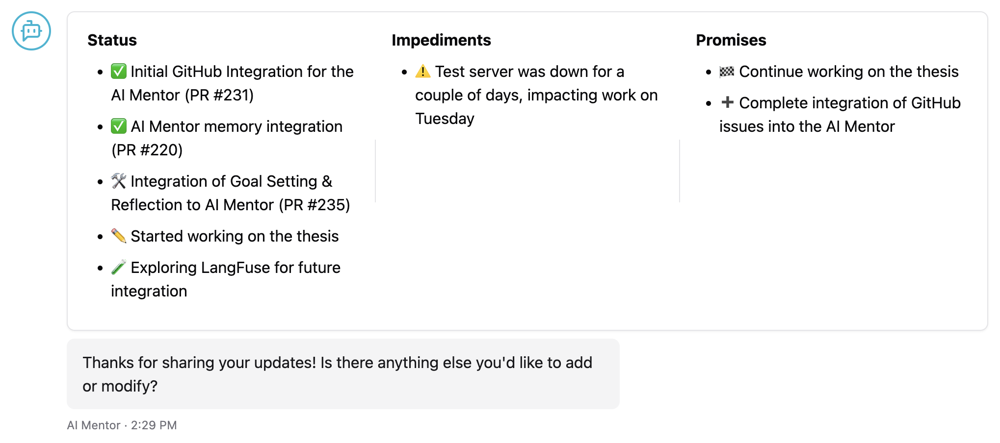

Heph — our process-aware AI mentor — delivers personalized, data-informed feedback grounded in the issues, commits, reviews, and pull requests you work on. It guides self-reflection, keeps track of progress, and reduces stress by organizing check-ins throughout the project lifecycle.

## Launching a session

Open the AI mentor from the top navigation bar and select **Start session** to begin—Heph kicks off the conversation for you.

:::note Session history
Previous sessions appear in the left-hand panel. Select any entry to review the conversation and generated summary.
:::

## Chat flow

### Getting started

Heph greets you with a structured introduction. Answer the opening questions to establish your goals for the week.

Your past sessions remain accessible in the sidebar for easy reference.

:::tip Start fresh when you are ready
Use **New session** to begin a new reflection. If the previous session is unfinished, Heph will continue to reference the earlier context.
:::

### Pull request overview

Heph analyses the repositories connected to your workspace and lists pull requests active in the last week. Select the PRs relevant to your progress summary—these will inform later prompts.

### Status updates

Heph walks you through what you achieved, obstacles you encountered, and what you plan next. The mentor adapts its follow-up questions based on the PRs and goals you highlighted earlier.

### Session summary

At the end of each session, Heph generates a summary that doubles as a standup report. Review the summary and make edits as needed.

When you are satisfied, save the summary as an artifact. You can export it as Markdown, share a link with your team, or pin it to your dashboard to track follow-up actions.

## Walkthrough videos

- **Starting your first session:**

  <iframe src="https://live.rbg.tum.de/w/artemisintro/59978?video_only=1&t=0" allowFullScreen frameBorder="0" width="600" height="350" title="AI mentor introduction" />

- **Full mentor experience:**

  <iframe src="https://live.rbg.tum.de/w/artemisintro/59979?video_only=1&t=0" allowFullScreen frameBorder="0" width="600" height="350" title="AI mentor walkthrough" />
