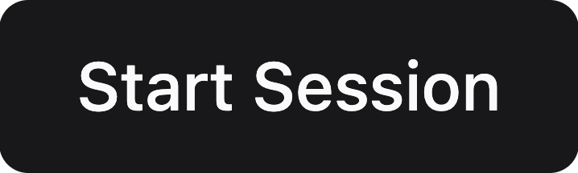

# AI Mentor
- [Overview](#overview)
- [Chat Flow](#chat-flow)
  - [Getting Started](#getting-started)
  - [PR Overview](#pr-overview)
  - [Status Updates](#status-updates)
  - [Session Summary](#session-summary)
  - [Goal Setting and Alignment](#goal-setting-and-alignment)
## Overview 
Hephaestus AI Mentor is a tool that supports students during software engineering projects. It’s designed to make self-reflection easier, help track development progress, and keep developers focused on their goals. Many students run into issues like poor planning or feeling rushed - AI Mentor helps by guiding regular check-ins and keeping things organized throughout the project.

## Chat Flow 
### Getting Started
You can open the AI Mentor from the top bar of the Hephaestus platform. Click the button to open the chat interface.
```{figure} ./mentor_button.png
:alt: AI Mentor Button
```

Click {w=100px} to begin your first session — AI Mentor will start the conversation automatically.
```{figure} ./getting_started.png
:alt: Start Session Interface
```

Your past sessions are listed in the session history on the left bar. Click any of them to revisit and review.
```{figure} ./history.png
:alt: Session History Interface
```

```{note}
You can start a new session at any time by clicking {w=100px}. Just note that if the previous session isn’t complete, AI Mentor will not have full context of your progress.
```

### PR Overview
AI Mentor uses information from the GitHub repositories you’ve been working on. It reviews all pull requests (PRs) that were active in the last week and displays them in an interactive interface linked directly to GitHub.

You can mark which PRs are relevant for the current week’s progress summary. AI Mentor will use this information in later parts of the session to support your reflection.
```{figure} ./pr_overview.png
:alt: Overview of the Last Week's PRs
:width: 450px
```

### Status Updates
Throughout the reflective session, AI Mentor will guide you through a review of your past week — what you worked on, challenges you faced, and plans for the next week.

### Session Summary
After the status update, AI Mentor will generate a summary of your stand-up. You can revise this summary if anything was misunderstood and suggest changes.
```{figure} ./summary.png
:alt: Summary of the Progress
:width: 700px
```

### Goal Setting and Alignment
During your first session, AI Mentor will help you define your goals and outline your current project objectives. In later sessions, the mentor will return to these goals, offering helpful insights, suggesting possible adjustments, and asking questions that support self-reflection. The goal of the mentor is to help you reflect on your objectives, stay aligned with them, and reduce stress throughout the project.