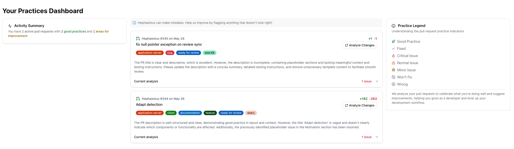
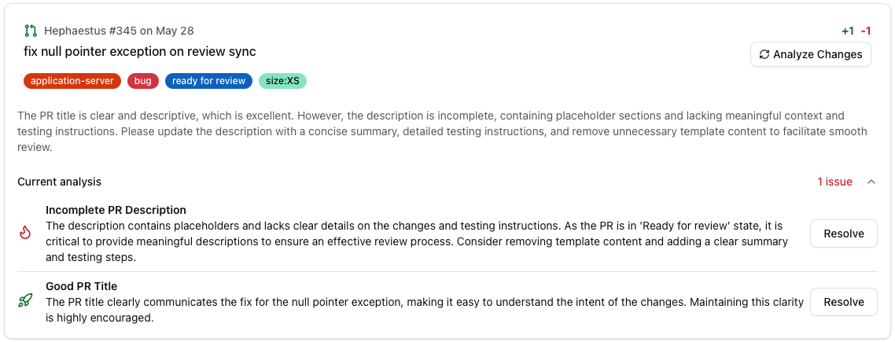
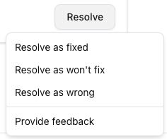
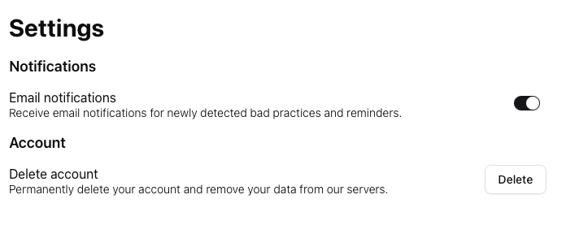

The **Best Practices** page helps reviewers learn from high- and low-quality examples in their pull requests. It lists all assigned and open pull requests, highlights detected practices, and lets you trigger additional analysis as needed.

## Accessing the page

Open **Best Practices** from the navigation. You will see a dashboard summarising your queue, the state of each pull request, and a legend for detected practices.

## Running an analysis

Hephaestus automatically analyses pull requests when key lifecycle events occur (created, ready for review, ready to merge, merged). You can also force an analysis:

1. Select a pull request from the list.
2. Choose **Analyse changes** to run detection with the latest commits.
3. Review the **Current analysis** section for detected good and bad practices.

Each practice includes a title, description, severity, detection state, and optional reviewer feedback.

## Managing practice states

Use the **Resolve** menu to update the state of a detected practice:

- **Fixed** – The issue has been addressed.
- **Won't fix** – The team agreed the practice is acceptable for now.
- **Wrong** – The detection was inaccurate.

When you disagree with a detection, leave feedback. Your comments go straight to the Hephaestus team to improve future models.

## Notifications

If automatic detection finds a critical bad practice, Hephaestus emails the assignee. Configure notification preferences under **Settings → Notifications**.

:::tip Fresh data wins
The Best Practices page always shows the latest pull request state. Re-run an analysis after addressing feedback to verify the fix.
:::
