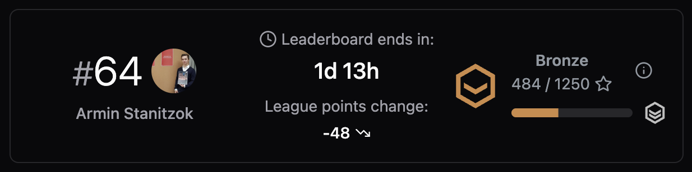
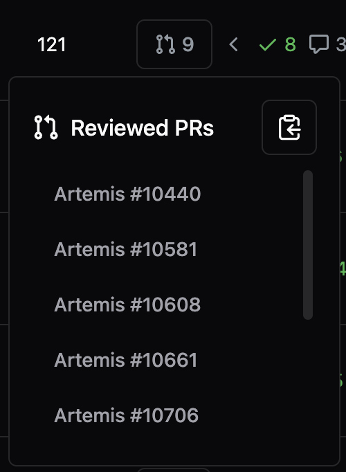
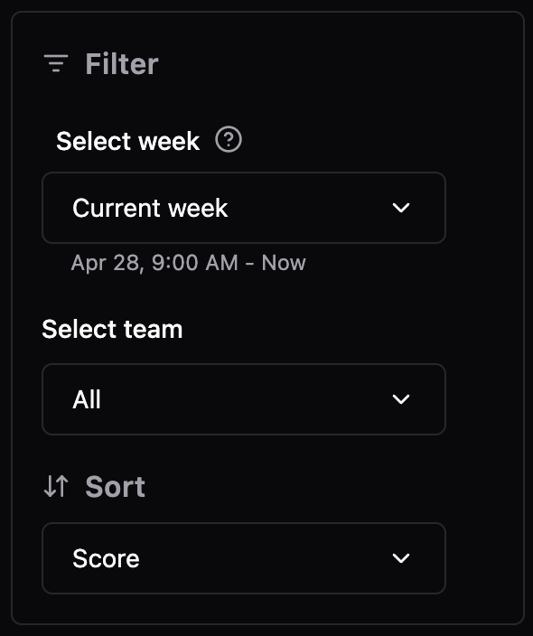

A weekly view of review activity across your workspace.

## Open it

Sign in with GitHub. The leaderboard is the landing page; the Hephaestus logo brings you back.

<iframe height="450" width="600" src="https://live.rbg.tum.de/w/artemisintro/59981?video_only=1&t=0" title="Tour the weekly leaderboard" frameBorder="0" allow="accelerometer; autoplay; clipboard-write; encrypted-media; gyroscope; picture-in-picture; web-share" allowFullScreen />

## The overview card

The card at the top shows where you are this week:

- Current rank within the selected leaderboard.
- Time remaining until the week resets.
- Projected **league point** adjustment based on your position.
- Your league tier and progress towards the next tier.

:::tip Jump to your row
Selecting your rank in the overview card scrolls the table to highlight your entry.
:::

## Table columns and reviewer drawer

The leaderboard table includes rank, contributor, leaderboard score, and activity summary. Selecting any reviewer opens a detailed drawer that shows:

- Pull requests reviewed that week with direct GitHub links.
- Key statistics such as additions, deletions, and review sentiment.
- A **Copy** action that formats review highlights for sharing in standups or retrospectives.

## Exploring previous weeks and teams

- Use the **time period** dropdown to switch between the current and previous weeks (the last four are stored by default).
- Apply the **team filter** to scope the view to specific cohorts. Your personal rank only appears when the selected team includes you.
- Filter by **labels** when your organisation tags pull requests per exercise or milestone.

:::note League scoring
Weekly points feed into the Elo-inspired league system. Consistent performance moves you through Bronze, Silver, and Gold leagues.
:::

## Slack and email

Hephaestus posts the top three reviewers to Slack each Monday, with links to their work. Turn on the digest in **Settings → Integrations**. Email summaries are opt-in too.
