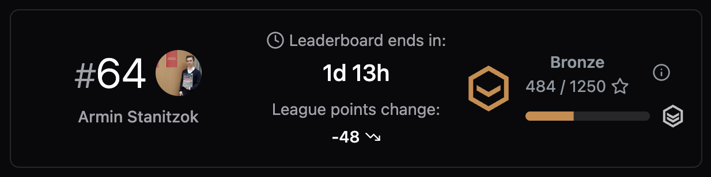
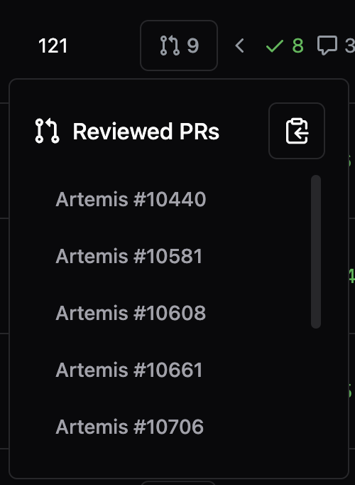
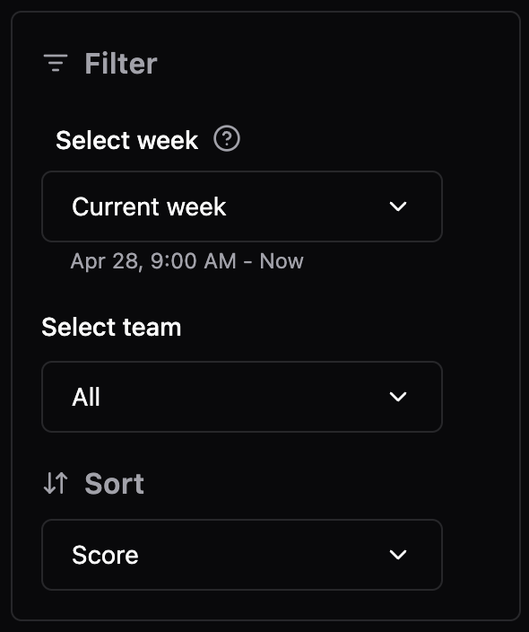

Hephaestus includes an optional weekly leaderboard that tracks review activity across your workspace. Workspace admins decide whether it is enabled. Scores are recalculated continuously, so the table reflects your contributions in near real time.

## Accessing the leaderboard

Sign in and select a workspace. When that workspace has the leaderboard enabled, it is the workspace home page.

<iframe height="450" width="600" src="https://live.rbg.tum.de/w/artemisintro/59981?video_only=1&t=0" title="Tour the weekly leaderboard" frameBorder="0" allow="accelerometer; autoplay; clipboard-write; encrypted-media; gyroscope; picture-in-picture; web-share" allowFullScreen />

## Reading the overview card

The overview card summarises your position on the current leaderboard:

- Current rank within the selected leaderboard.
- Time remaining until the week resets.
- When leagues are also enabled, your projected **league point** adjustment, current tier, and progress towards the next tier.

:::tip Jump to your row
Selecting your rank in the overview card scrolls the table to highlight your entry.
:::

## Table columns and the reviewed-work popover

The leaderboard table includes rank, contributor, leaderboard score, and activity summary. Selecting a
contributor opens their profile. Selecting their reviewed-work count opens a popover listing the pull
requests or merge requests they reviewed in the selected period, each linked to the source platform,
with a **Copy** action that formats the list for sharing in standups or retrospectives.

## Exploring previous weeks and teams

- Use the **Timeframe** dropdown to switch between this week, last week, this month, last month, or a custom range. Each selection is ranked on demand from synced activity, so any range you pick works.
- Apply the **Team** filter to view review activity within a specific team. Your personal rank only appears when the selected team includes you.

:::note Optional league scoring
When a workspace admin enables leagues, weekly points feed into the Elo-inspired league system. League information is hidden when the feature is off.
:::

## Recognition and notifications

A workspace admin can configure a weekly Slack digest for a selected channel and team. The admin chooses the day, the time, and the destination under **Administration → Integrations → Slack**; the time is read in the workspace timezone. Hephaestus does not send a leaderboard digest unless this option is enabled.
