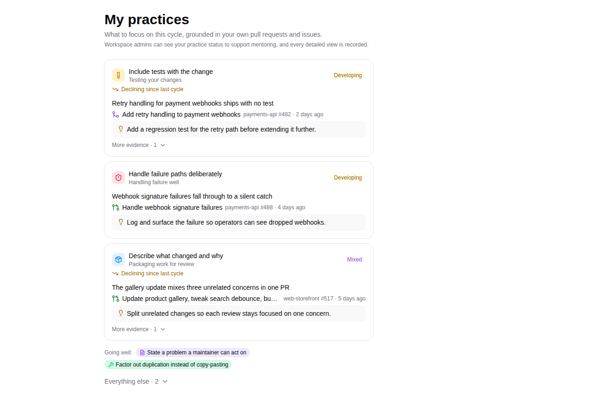
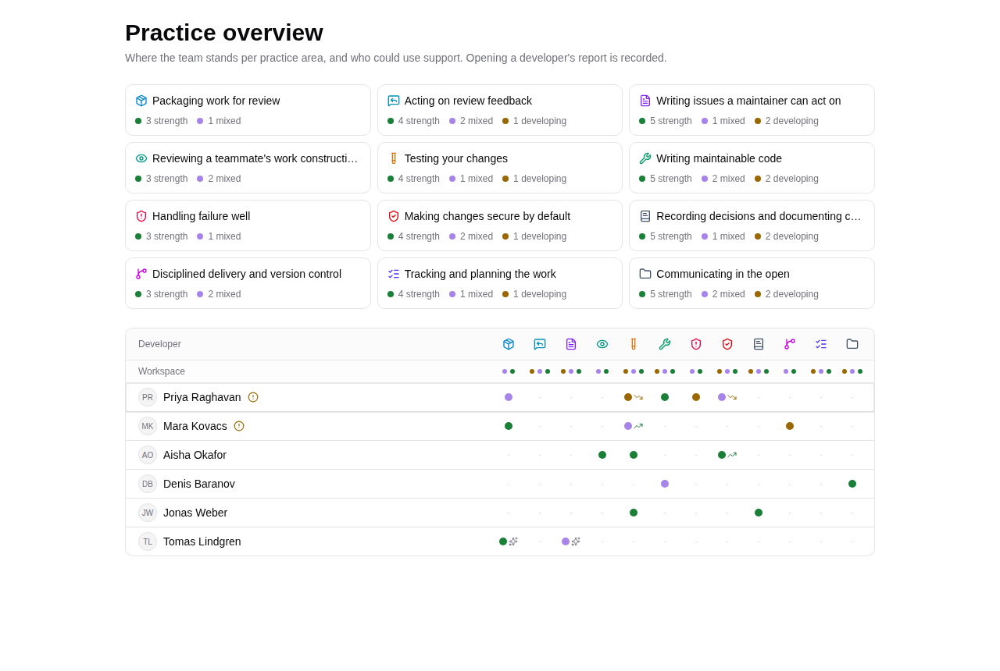
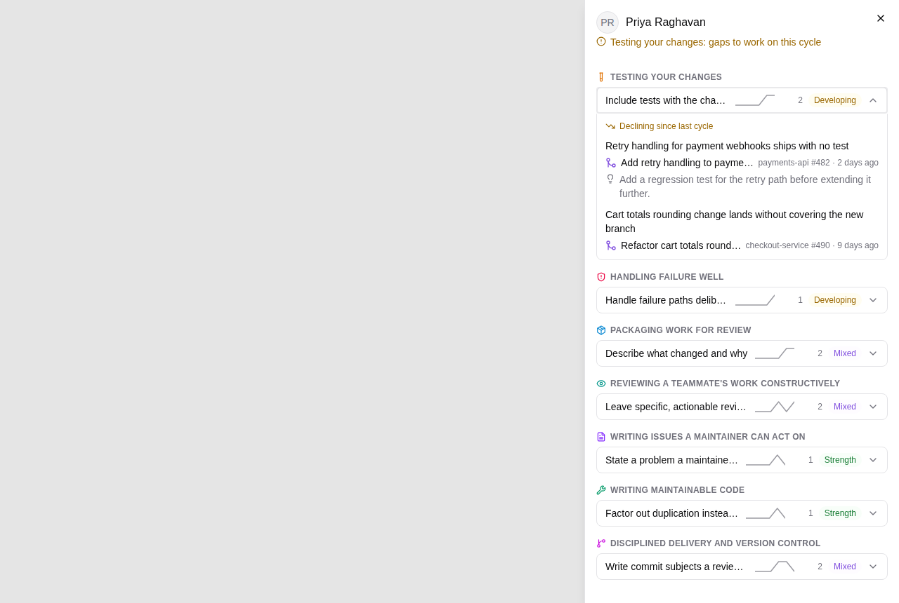
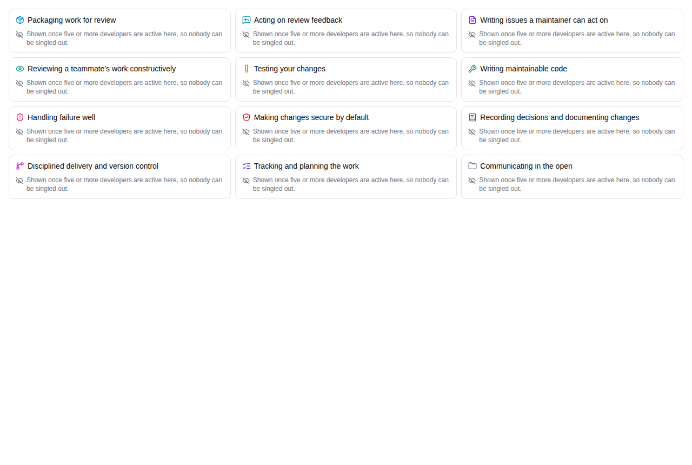

Hephaestus reads your pull requests, issues, and reviews and turns what it observes into practice feedback. Two pages carry that feedback: **My practices** for you, and **Practice overview** for the mentors supporting the workspace. Every claim on both pages links the concrete piece of work it came from.

## My practices: what you see

**My practices** opens with at most three practices worth your attention this cycle. Each focus card shows:

- the practice and its area, with a status chip (Strength, Mixed, or Developing) and a trend note such as "Improving since last cycle",
- the evidence that earned the spot, deep-linking the pull request or issue it came from with the repository, the number, and when it was observed,
- one concrete next step where feedback was delivered.

Below the focus cards, practices you are doing well appear as compact chips, and the remaining practices sit behind an "Everything else" disclosure with their status, trend, and observation count. The default view fits on one screen.

Status is judged against each practice's own criteria for the current review cycle. Your page is about your own trajectory, and each practice is judged on its own terms.

:::info Who can see this
Workspace admins can see your practice status to support mentoring, and every detailed view is recorded. The same line appears on the page itself.
:::

## Practice overview: what mentors see

Workspace administrators and owners have a **Practice overview** page for mentoring:

- **Workspace health** shows, per practice area, how many developers stand at each status. Counts are people per status, never named.
- **The area matrix** lists developers with recent activity as one row of status dots across the practice areas, with trend arrows where they carry signal. Clicking an area icon in the header filters the roster to developers with signal there. People who could use support come first, as a triage aid.
- **The drill-down** opens a side panel with one line per practice (name, activity sparkline, observation count, status) that expands to the same evidence and deep links the developer sees on their own page.

## How suppression works

The workspace health counts are aggregate by design. When fewer than five developers are active in an area, the counts stay hidden and the card says so: "Shown once five or more developers are active here, so nobody can be singled out." The same rule applies when any single status bucket is small enough to identify someone. An area with zero recent activity shows "No activity in this area yet", which is a different state from suppression.

Administrators and owners see full counts, because they already see every developer by name on the roster. The **workspace health visibility** setting controls whether members can see the aggregate view too; when shared, it stays aggregated and small groups remain suppressed.

## Access is controlled and audited

The named roster and the per-developer drill-down are restricted to workspace **administrators and owners**. Every time either is viewed, Hephaestus records an append-only audit entry (who accessed whose report, and when) as a compliance record.

Questions about how this data is handled? See the privacy statement linked in the app footer.
